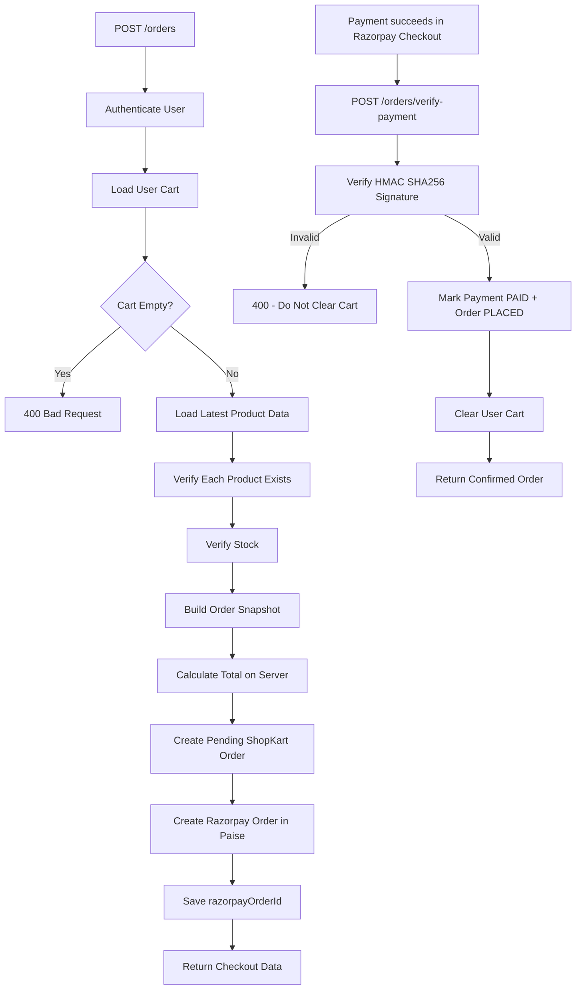

# 💳 Engineering Lab 06 — ShopKart Checkout & Orders

> **Complete the ShopKart purchase journey by converting a user's cart into a persistent order.**
>
> This is the final lab in the ShopKart sequence. Your goal is to connect everything built so far—authentication, products, wishlist, cart, state management and backend validation—into one complete full-stack flow.

---

## 📋 Lab Overview

| | |
|---|---|
| **Application** | ShopKart |
| **Lab** | 06 |
| **Duration** | 3 Hours |
| **Mode** | Individual |
| **Total Marks** | **100** |
| **Primary Theme** | Checkout + Razorpay Test Payment + Order Creation + Business Rules |
| **Frontend** | React |
| **Backend** | Node.js + Express |
| **Database** | MongoDB |
| **Authentication** | JWT |
| **State Management** | Reuse existing Cart state |

---

# 1. 🎯 Product Brief

A customer has added products to their cart.

But a cart is still temporary.

The application must now answer:

- Where should the order be delivered?
- Are all cart items still available?
- What price should be saved in the order?
- What happens after the order is placed?
- Should the cart remain populated?
- Can the user view previous orders?

### Desired experience

```text
Cart
  ↓
Proceed to Checkout
  ↓
Enter Shipping Details
  ↓
Review Order
  ↓
Place Order
  ↓
Order Created
  ↓
Cart Cleared
  ↓
Order Confirmation
  ↓
My Orders
```

---

# 2. 🧑‍💻 What Are You Building?

You are extending the ShopKart application from Labs 01–05.

### Final user journey

```mermaid
flowchart LR
    A[Products] --> B[Cart]
    B --> C[Checkout]
    C --> D[Validate Address]
    D --> E[Verify Stock]
    E --> F[Create Pending ShopKart Order]
    F --> G[Create Razorpay Order]
    G --> H[Open Razorpay Checkout]
    H --> I[Verify Payment Signature]
    I --> J[Mark Order Paid]
    J --> K[Clear Cart]
    K --> L[Order Success]
    L --> M[My Orders]
```



### Feature scope

- Shipping address form
- Checkout page
- Final cart review
- Final stock verification
- Order schema
- Create Order API
- Order price snapshot
- Razorpay Test Mode payment integration
- Server-side Razorpay Order creation
- Razorpay Checkout on the frontend
- Mandatory payment-signature verification
- Payment status persistence
- Clear cart only after verified payment
- Order confirmation page
- My Orders page
- Protected order APIs
- Loading, validation and error states

> **Payment integration is mandatory in this lab.** Use Razorpay **Test Mode** only. No real money should be used.

---

# 3. 🧠 Learning Objectives

By the end of this lab, you should understand:

### Backend

- Converting temporary state into permanent business data
- Order modelling
- Snapshotting product information
- Server-side stock validation
- Protected user-specific resources
- Updating multiple related resources in one workflow

### Frontend

- Multi-step user flow
- Form state and validation
- Checkout UX
- Server mutation followed by global-state reset
- Rendering historical data

### Engineering

- Why the server must revalidate important business rules
- Why order data should not depend entirely on future Product changes
- Why successful mutations must update all affected parts of the UI

---

# 4. 📦 Order Data Model

Create a new `Order` model.

Recommended structure:

```js
const orderSchema = new mongoose.Schema(
  {
    user: {
      type: mongoose.Schema.Types.ObjectId,
      ref: "User",
      required: true
    },

    items: [
      {
        product: {
          type: mongoose.Schema.Types.ObjectId,
          ref: "Product",
          required: true
        },
        name: {
          type: String,
          required: true
        },
        price: {
          type: Number,
          required: true
        },
        quantity: {
          type: Number,
          required: true
        },
        image: {
          type: String
        }
      }
    ],

    shippingAddress: {
      fullName: String,
      phone: String,
      addressLine1: String,
      city: String,
      state: String,
      pincode: String
    },

    totalAmount: {
      type: Number,
      required: true
    },

    paymentStatus: {
      type: String,
      enum: ["PENDING", "PAID", "FAILED"],
      default: "PENDING"
    },

    status: {
      type: String,
      enum: ["PENDING_PAYMENT", "PLACED", "CONFIRMED", "SHIPPED", "DELIVERED"],
      default: "PENDING_PAYMENT"
    },

    razorpayOrderId: String,
    razorpayPaymentId: String
  },
  { timestamps: true }
);
```

### Why snapshot name and price?

Suppose:

```text
Today:
Keyboard = ₹2,999

Next month:
Keyboard = ₹3,499
```

An old order should still show:

```text
₹2,999
```

The order represents what the user actually purchased at that time.

---

# 5. 🔌 API Contract

| Method | Endpoint | Auth | Purpose |
|---|---|:---:|---|
| POST | `/orders/create-payment-order` | ✅ | Validate cart, create ShopKart pending order and Razorpay Order |
| POST | `/orders/verify-payment` | ✅ | Verify Razorpay signature and confirm ShopKart order |
| GET | `/orders` | ✅ | Get current user's orders |
| GET | `/orders/:id` | ✅ | Get one order |

---

# 6. 🧩 Task 1 — Create Order Model
### **15 Marks**

Create the Order schema.

### Requirements

- User reference
- Array of order items
- Product reference in each item
- Product name snapshot
- Product price snapshot
- Quantity
- Optional image snapshot
- Shipping address
- Total amount
- Status
- Created timestamp

Do not store only:

```js
{
  productId,
  quantity
}
```

An order must remain meaningful even if Product data changes later.

---

# 7. 🏠 Task 2 — Checkout Page
### **15 Marks**

Create:

```text
/checkout
```

The user should reach this page using:

```text
Proceed to Checkout
```

from the Cart page.

### Checkout layout

```text
┌────────────────────────────────────────────────────────────┐
│ Checkout                                                   │
├────────────────────────────────────────────────────────────┤
│ Shipping Details                                           │
│                                                            │
│ Full Name      [________________________]                   │
│ Phone          [________________________]                   │
│ Address        [________________________]                   │
│ City           [________________________]                   │
│ State          [________________________]                   │
│ Pincode        [________________________]                   │
│                                                            │
├────────────────────────────────────────────────────────────┤
│ Order Summary                                              │
│                                                            │
│ Keyboard × 2                           ₹5,998               │
│ Mouse × 1                              ₹1,499               │
│                                                            │
│ Total                                  ₹7,497               │
│                                                            │
│                      [ Place Order ]                        │
└────────────────────────────────────────────────────────────┘
```

---

# 8. ✍️ Task 3 — Shipping Form Validation
### **10 Marks**

The checkout form should collect:

- Full Name
- Phone Number
- Address Line
- City
- State
- Pincode

### Validation rules

- No required field can be empty
- Phone should contain a valid number format
- Pincode should contain 6 digits
- Whitespace-only input is invalid

Display field-level or form-level validation errors.

Example:

```text
Pincode must contain 6 digits.
```

Do not call the backend if basic client validation fails.

---

# 9. 🛡️ Task 4 — Create Order API
### **20 Marks**

### Endpoint

```http
POST /orders/create-payment-order
```

### Request body

The frontend should send only the shipping address.

Example:

```json
{
  "shippingAddress": {
    "fullName": "Aarav Sharma",
    "phone": "9876543210",
    "addressLine1": "22 MG Road",
    "city": "Bengaluru",
    "state": "Karnataka",
    "pincode": "560001"
  }
}
```

> Do not trust cart prices or totalAmount sent by the frontend.

### Required backend flow



---

# 10. 📦 Final Stock Verification

Before creating the order, validate every cart item again.

Example:

```text
Cart:
Keyboard × 3

Current Product Stock:
Keyboard = 2
```

The order must fail.

Return:

```http
400 Bad Request
```

with a useful message such as:

```text
Insufficient stock for Mechanical Keyboard.
```

Why?

Because stock may have changed after the item was added to the cart.

---

# 11. 🧮 Server-Side Total Calculation

The backend must calculate:

```text
totalAmount = Σ(latestProduct.price × quantity)
```

Example:

```text
Keyboard
₹2,999 × 2 = ₹5,998

Mouse
₹1,499 × 1 = ₹1,499

Total = ₹7,497
```

### Important

Never trust this from the frontend:

```json
{
  "totalAmount": 1
}
```

The server owns pricing rules.

---

# 12. 🧾 Order Snapshot Creation

When the order is created, copy the current Product information into each order item.

Example:

```js
{
  product: product._id,
  name: product.name,
  price: product.price,
  quantity: cartItem.quantity,
  image: product.image
}
```

This is intentionally different from the Cart model.

### Cart

Dynamic reference to current product data.

### Order

Historical snapshot of purchase-time data.

---

# 13. 🧹 Task 5 — Clear Cart After Success
### **5 Marks**

After the Razorpay payment signature is successfully verified:

```js
user.cart = [];
```

Save the user.

> Creating a pending order or merely opening Razorpay Checkout is **not** enough to clear the cart.

The frontend must also update its global Cart state.

Expected flow:

```text
Pay with Razorpay
    ↓
Create Razorpay Order
    ↓
Razorpay Checkout
    ↓
Payment succeeds
    ↓
Backend verifies signature
    ↓
Order becomes PAID / PLACED
    ↓
Backend cart cleared
    ↓
Frontend cart state cleared
    ↓
Navbar becomes Cart (0)
```

Do not clear the cart before the order has been successfully created.

---

# 14. ✅ Task 6 — Order Confirmation
### **10 Marks**

After successful order creation, navigate to an order success screen.

You may use:

```text
/order-success/:id
```

or:

```text
/orders/:id
```

Suggested UI:

```text
✅ Order Placed Successfully

Order ID:
67abc123...

Total:
₹7,497

Status:
PLACED

Your order has been saved successfully.

[ View My Orders ]
[ Continue Shopping ]
```

---

# 15. 📚 Task 7 — My Orders API
### **10 Marks**

### Endpoint

```http
GET /orders
```

Return only orders belonging to the authenticated user.

Recommended sorting:

```text
Newest order first
```

Example response:

```json
{
  "success": true,
  "orders": [
    {
      "_id": "67abc123",
      "totalAmount": 7497,
      "status": "PLACED",
      "createdAt": "2026-10-05T10:00:00.000Z",
      "items": []
    }
  ]
}
```

---

# 16. 🧾 Task 8 — My Orders Page
### **10 Marks**

Create:

```text
/orders
```

Suggested UI:

```text
My Orders

┌────────────────────────────────────────────────────┐
│ Order #67abc123                                    │
│ 5 Oct 2026                                         │
│                                                    │
│ Keyboard × 2                                       │
│ Mouse × 1                                          │
│                                                    │
│ Total: ₹7,497                                      │
│ Status: PLACED                                     │
│                                                    │
│ [ View Details ]                                   │
└────────────────────────────────────────────────────┘
```

The page must support:

- Loading state
- Empty state
- Error state

### Empty state

```text
You have not placed any orders yet.

[ Start Shopping ]
```

---

# 17. 🔍 Single Order API

### Endpoint

```http
GET /orders/:id
```

### Rules

- User must be authenticated
- Order must exist
- User must own the order

A user must never be able to access another user's order by guessing its ID.

---

# 18. 🚨 Important Business Rules

| Rule | Expected Behaviour |
|---|---|
| User must be authenticated | Protect all order APIs |
| Cart cannot be empty | Reject order |
| Product deleted after cart addition | Reject order |
| Stock becomes insufficient | Reject order |
| Frontend sends fake total | Ignore it |
| Razorpay Order created | Keep cart unchanged |
| Payment signature invalid | Keep order pending/failed and keep cart |
| Payment verified successfully | Mark paid and clear cart |
| Order creation fails | Keep cart unchanged |
| Product price changes later | Old order price stays unchanged |
| User requests someone else's order | 404 or 403 |
| Invalid shipping data | Reject request |

---

# 19. 🧪 Postman Test Plan

Test the backend before wiring React.

### Test 1 — Empty cart

```http
POST /orders
```

Expected:

```text
400 Bad Request
```

### Test 2 — Create payment order

Call:

```http
POST /orders/create-payment-order
```

Expected a ShopKart order id, Razorpay order id, amount and currency.

### Test 3 — Cart before payment verification

After creating the Razorpay Order but before verification:

```http
GET /cart
```

Expected: cart should still contain its items.

### Test 4 — Verify successful payment

Complete a Test Mode payment and send the returned payment id, Razorpay order id and signature to:

```http
POST /orders/verify-payment
```

Expected: paymentStatus = PAID and status = PLACED.

### Test 5 — Confirm cart cleared

```http
GET /cart
```

Expected empty cart.

### Test 6 — Get Orders

```http
GET /orders
```

Expected newly created order.

### Test 7 — Insufficient stock

Add quantity greater than available stock and try checkout.

Expected:

```text
400 Bad Request
```

### Test 8 — Fake total sent from frontend

Send:

```json
{
  "totalAmount": 1
}
```

Backend should ignore it and calculate the real total.

### Test 9 — Unauthenticated request

Expected:

```text
401 Unauthorized
```

### Test 10 — Access another user's order

Expected:

```text
403 Forbidden
```

or:

```text
404 Not Found
```

---

# 20. 🧱 Suggested Backend Structure

```text
backend/
│
├── controllers/
│   ├── cart.controller.js
│   └── order.controller.js
│
├── config/
│   └── razorpay.js
│
├── models/
│   ├── user.model.js
│   ├── product.model.js
│   └── order.model.js
│
├── routes/
│   ├── cart.routes.js
│   └── order.routes.js
│
├── middlewares/
│   └── auth.middleware.js
│
└── index.js
```

---

# 21. 🧱 Suggested Frontend Structure

```text
src/
│
├── pages/
│   ├── Cart.jsx
│   ├── Checkout.jsx
│   ├── Orders.jsx
│   └── OrderDetails.jsx
│
├── components/
│   ├── CheckoutForm.jsx
│   ├── OrderSummary.jsx
│   └── OrderCard.jsx
│
├── features/
│   └── cart/
│       └── cartSlice.js
│
├── services/
│   └── api.js
│
└── App.jsx
```

You may structure the application differently if responsibilities remain clear.

---

# 22. ✅ Acceptance Criteria

## Backend

- [ ] Order model exists
- [ ] Order stores purchase-time snapshot
- [ ] Shipping address is validated
- [ ] Order API uses authenticated user's cart
- [ ] Product data is loaded again before order creation
- [ ] Stock is verified again
- [ ] Total is calculated on server
- [ ] Fake frontend totals are ignored
- [ ] Pending ShopKart order is persisted
- [ ] Razorpay Order is created on the backend
- [ ] Amount sent to Razorpay is converted to paise
- [ ] Razorpay Key Secret never reaches the frontend
- [ ] Razorpay Checkout opens from the frontend
- [ ] Successful Checkout response is sent to the backend
- [ ] Payment signature is verified on the backend
- [ ] Order becomes PAID only after verification
- [ ] Cart clears only after successful payment verification
- [ ] Get Orders API returns current user's orders
- [ ] Single order API enforces ownership

## Frontend

- [ ] Checkout page exists
- [ ] Shipping form works
- [ ] Form validation exists
- [ ] Final cart summary is shown
- [ ] Place Order has loading state
- [ ] Backend errors are visible
- [ ] Successful order clears global cart state
- [ ] Navbar updates to Cart (0)
- [ ] Confirmation screen exists
- [ ] My Orders page exists
- [ ] Loading state exists
- [ ] Empty state exists
- [ ] Error state exists

---

# 23. 📊 Evaluation Rubric

| Area | Marks |
|---|---:|
| Order Model + Snapshot Design | 15 |
| Checkout Page + Shipping Form | 15 |
| Form Validation | 10 |
| Checkout + Razorpay Order API | 15 |
| Razorpay Checkout Integration | 15 |
| Payment Signature Verification | 15 |
| Stock + Server Total Validation | 10 |
| Cart Clearing + State Sync | 5 |
| Order Confirmation | 5 |
| My Orders API + Page | 5 |
| Code Quality + Viva | 5 |
| **Total** | **100** |

---

# 24. 🎤 TA Viva Questions

Ask any 5–7 depending on implementation.

### Payments

1. Why must the Razorpay Order be created from the backend?
2. Why is the Razorpay Key Secret never sent to React?
3. Why does Razorpay expect INR amounts in paise?
4. What are `razorpay_order_id`, `razorpay_payment_id` and `razorpay_signature`?
5. Why is signature verification mandatory?
6. Why should the cart not be cleared when Checkout merely opens?
7. What would happen if the client simply sent `paymentSuccess: true`?

### Orders

8. Why does an Order store product name and price separately from the Product document?
9. Why should order price not change when product price changes?
10. What is the difference between Cart data and Order data?
11. Why should an Order reference the User?

### Security & Business Logic

12. Why should the backend calculate totalAmount?
13. Why must stock be checked again during checkout?
14. Why should the frontend not send the final order items as trusted data?
15. How do you prevent a user from reading someone else's order?

### State Management

16. Why must global cart state be cleared after order creation?
17. What happens if the backend order succeeds but frontend state is not updated?
18. Why should cart remain untouched if order creation fails?

### React

19. Where should checkout form state live?
20. What loading states should exist while placing an order?
21. What should happen if the cart is empty and a user directly opens `/checkout`?

---

# 25. 🚫 Common Mistakes

### ❌ Trusting total from frontend

Never do:

```js
const totalAmount = req.body.totalAmount;
```

Calculate it on the server.

---

### ❌ Storing only Product references in orders

If product data changes, order history becomes inaccurate.

Snapshot important purchase-time information.

---

### ❌ Clearing cart before order save

Wrong:

```text
Clear Cart
   ↓
Create Order
   ↓
Order fails
```

The customer loses their cart.

Correct:

```text
Create Order
   ↓
Success
   ↓
Clear Cart
```

---

### ❌ Skipping final stock check

Cart state may be old.

Stock can change between:

```text
Add to Cart → Checkout
```

---

### ❌ Allowing any authenticated user to fetch any order

Always verify:

```text
order.user === req.user.id
```

---


---

# 26. 💳 Mandatory Razorpay Test Mode Integration

This lab must include a working Razorpay Standard Checkout integration using **Test Mode**.

The payment architecture should be:

```text
React Checkout
      ↓
POST /orders/create-payment-order
      ↓
Backend validates cart + latest stock + latest prices
      ↓
Backend calculates final total
      ↓
Backend creates ShopKart Order (PENDING_PAYMENT)
      ↓
Backend creates Razorpay Order
      ↓
Razorpay order_id returned to React
      ↓
React opens Razorpay Checkout
      ↓
Test payment
      ↓
Razorpay returns:
payment_id + order_id + signature
      ↓
React sends them to /orders/verify-payment
      ↓
Backend verifies signature
      ↓
PAID + PLACED
      ↓
Clear Cart
      ↓
Success Page
```

---

# 27. 🧑‍🏫 Razorpay Integration Guide — Step by Step

## Step 1 — Create a Razorpay Account

Create/login to a Razorpay account and open the Razorpay Dashboard.

Keep the account in **Test Mode** for this lab.

Do not use Live Mode credentials.

---

## Step 2 — Generate Test API Keys

From the Razorpay Dashboard, generate API keys while Test Mode is enabled.

You will receive:

```text
Key ID
Key Secret
```

Example format:

```env
RAZORPAY_KEY_ID=rzp_test_xxxxxxxxx
RAZORPAY_KEY_SECRET=xxxxxxxxxxxxxxxx
```

### Security rule

`RAZORPAY_KEY_SECRET` belongs **only on the backend**.

Never:

- Put the secret in React
- Commit it to GitHub
- Send it in an API response
- Hardcode it in frontend JavaScript

Add `.env` to `.gitignore`.

---

## Step 3 — Install Razorpay on the Backend

From the backend folder:

```bash
npm install razorpay
```

Node's built-in `crypto` module will be used for signature verification.

---

## Step 4 — Add Environment Variables

Backend `.env`:

```env
RAZORPAY_KEY_ID=rzp_test_xxxxxxxxx
RAZORPAY_KEY_SECRET=your_test_secret
```

Restart the backend after changing environment variables.

---

## Step 5 — Create Razorpay Configuration

Example:

```js
// config/razorpay.js

import Razorpay from "razorpay";

const razorpay = new Razorpay({
  key_id: process.env.RAZORPAY_KEY_ID,
  key_secret: process.env.RAZORPAY_KEY_SECRET
});

export default razorpay;
```

---

## Step 6 — Extend the ShopKart Order Model

Store payment information with the order:

```js
paymentStatus: {
  type: String,
  enum: ["PENDING", "PAID", "FAILED"],
  default: "PENDING"
},

status: {
  type: String,
  enum: [
    "PENDING_PAYMENT",
    "PLACED",
    "CONFIRMED",
    "SHIPPED",
    "DELIVERED"
  ],
  default: "PENDING_PAYMENT"
},

razorpayOrderId: String,
razorpayPaymentId: String
```

Never store the Razorpay Key Secret in MongoDB.

---

## Step 7 — Create the Payment Order API

Create:

```http
POST /orders/create-payment-order
```

The frontend sends shipping details.

The backend must:

1. Authenticate the user.
2. Load the user's cart.
3. Reject an empty cart.
4. Load latest Product documents.
5. Validate stock.
6. Calculate total on the backend.
7. Build the order snapshot.
8. Create a ShopKart order with `PENDING_PAYMENT`.
9. Create a Razorpay Order.
10. Save the returned Razorpay Order ID.
11. Return safe Checkout information.

Example:

```js
const amountInRupees = totalAmount;

const razorpayOrder = await razorpay.orders.create({
  amount: Math.round(amountInRupees * 100),
  currency: "INR",
  receipt: shopKartOrder._id.toString()
});

shopKartOrder.razorpayOrderId = razorpayOrder.id;
await shopKartOrder.save();
```

### Why multiply by 100?

Razorpay expects the amount in the smallest currency unit.

For INR:

```text
₹1     → 100 paise
₹499   → 49900
₹7497  → 749700
```

---

## Step 8 — Return Checkout Data

Example response:

```json
{
  "success": true,
  "shopKartOrderId": "67abc123",
  "razorpayOrderId": "order_ABC123",
  "amount": 749700,
  "currency": "INR",
  "key": "rzp_test_xxxxxxxxx"
}
```

The Key ID may be sent to the frontend.

The Key Secret must never be sent.

---

## Step 9 — Load Razorpay Checkout in React

Razorpay Standard Checkout requires its Checkout script.

One simple approach:

```js
const loadRazorpayScript = () => {
  return new Promise((resolve) => {
    const script = document.createElement("script");
    script.src = "https://checkout.razorpay.com/v1/checkout.js";

    script.onload = () => resolve(true);
    script.onerror = () => resolve(false);

    document.body.appendChild(script);
  });
};
```

Call it before opening Checkout.

Handle script-load failure instead of assuming `window.Razorpay` always exists.

---

## Step 10 — Open Razorpay Checkout

After receiving the backend response:

```js
const options = {
  key: data.key,
  amount: data.amount,
  currency: data.currency,
  name: "ShopKart",
  description: "ShopKart Order",
  order_id: data.razorpayOrderId,

  handler: async function (response) {
    // Do NOT mark payment successful here.

    await verifyPayment({
      shopKartOrderId: data.shopKartOrderId,
      razorpay_order_id: response.razorpay_order_id,
      razorpay_payment_id: response.razorpay_payment_id,
      razorpay_signature: response.razorpay_signature
    });
  },

  prefill: {
    name: shippingAddress.fullName,
    contact: shippingAddress.phone
  },

  theme: {}
};

const paymentObject = new window.Razorpay(options);

paymentObject.on("payment.failed", function (response) {
  console.error("Payment failed", response.error);
});

paymentObject.open();
```

### Critical idea

This callback:

```js
handler(response)
```

does **not** mean:

```text
Trust the browser → payment is valid
```

It means:

```text
Send the returned payment details to your backend for verification.
```

---

## Step 11 — Create Payment Verification API

Create:

```http
POST /orders/verify-payment
```

Request:

```json
{
  "shopKartOrderId": "67abc123",
  "razorpay_order_id": "order_ABC123",
  "razorpay_payment_id": "pay_XYZ123",
  "razorpay_signature": "signature_here"
}
```

---

## Step 12 — Verify Razorpay Signature

Use Node's built-in `crypto` module.

```js
import crypto from "crypto";

const body =
  order.razorpayOrderId + "|" + razorpay_payment_id;

const expectedSignature = crypto
  .createHmac("sha256", process.env.RAZORPAY_KEY_SECRET)
  .update(body)
  .digest("hex");

if (expectedSignature !== razorpay_signature) {
  return res.status(400).json({
    success: false,
    message: "Invalid payment signature"
  });
}
```

### Important

Use the Razorpay Order ID stored in your database as the trusted order id for signature generation.

Do not blindly trust an order id supplied by the browser.

---

## Step 13 — Confirm the Order

Only after signature verification succeeds:

```js
order.paymentStatus = "PAID";
order.status = "PLACED";
order.razorpayPaymentId = razorpay_payment_id;

await order.save();
```

Then clear the user's cart:

```js
user.cart = [];
await user.save();
```

Return the confirmed order.

---

## Step 14 — Update Frontend State

After `/orders/verify-payment` succeeds:

```text
Redux / Context cart = []
Navbar → Cart (0)
Navigate → Order Success
```

Do not wait for a page refresh to fix the cart count.

---

## Step 15 — Handle Payment Failure

Listen for:

```js
paymentObject.on("payment.failed", ...)
```

Display a useful message:

```text
Payment failed.

Your cart has not been cleared.
Please try again.
```

A failed payment must not create a completed ShopKart order.

The pending order may remain `PENDING` or be updated to `FAILED` depending on your implementation.

---

## Step 16 — Test the Complete Flow

Use Razorpay Test Mode only.

Test:

```text
Login
  ↓
Add Product
  ↓
Cart
  ↓
Checkout
  ↓
Shipping Address
  ↓
Pay with Razorpay
  ↓
Razorpay Test Checkout
  ↓
Successful Test Payment
  ↓
Signature Verification
  ↓
Order PLACED
  ↓
Cart (0)
  ↓
My Orders
```

Also deliberately test a failed payment.

No real money should be deducted in Test Mode.

---

# 28. 🔐 Payment Security Rules

Students must follow all of these:

- Never expose `RAZORPAY_KEY_SECRET`.
- Never trust the total received from React.
- Never trust a client-side `paymentSuccess` boolean.
- Never mark an order PAID before signature verification.
- Never clear the cart before payment verification.
- Never use the browser-provided order id as the only trusted source during HMAC verification.
- Never commit API secrets to GitHub.
- Calculate amount using current Product data on the backend.
- Store payment identifiers, not card details.
- Do not build your own card-number/CVV form.

---

# 29. 🧪 Razorpay-Specific Evaluation Tests

### Test A — Manipulated frontend amount

Change the amount in React DevTools.

Expected:

```text
Backend-generated Razorpay amount remains correct.
```

### Test B — Fake payment verification

Call `/orders/verify-payment` with a fake signature.

Expected:

```text
400 Invalid payment signature
Order must NOT become PAID
Cart must NOT clear
```

### Test C — Valid Test Mode payment

Expected:

```text
paymentStatus = PAID
status = PLACED
razorpayPaymentId stored
cart cleared
```

### Test D — Payment failure

Expected:

```text
Error shown
Cart preserved
No successful order confirmation
```

### Test E — Refresh My Orders

The paid order must still appear because it is persisted in MongoDB.

---

# 30. 🏁 Final ShopKart Architecture

```text
Authentication
      ↓
Product Catalogue
      ↓
Wishlist
      ↓
Shopping Cart
      ↓
Global State
      ↓
Checkout Form
      ↓
Backend Price + Stock Validation
      ↓
ShopKart Pending Order
      ↓
Razorpay Orders API
      ↓
Razorpay Test Checkout
      ↓
Payment Signature Verification
      ↓
PAID / PLACED Order
      ↓
Clear Cart
      ↓
Order History
```

This completes the end-to-end MERN commerce journey: **browse → save → cart → checkout → payment → verification → order history**.

# 26. 🌟 Bonus Challenge (+10 Marks)

Implement basic order status progression.

Allowed values:

```text
PLACED
CONFIRMED
SHIPPED
DELIVERED
```

For the bonus, you may create a temporary development/admin endpoint to update status.

Then display status visually on the Orders page.

---

# 27. 🏁 Final ShopKart Journey

After completing Lab-06, your application should support:

```text
Register / Login
       ↓
Browse Products
       ↓
Search / Filter
       ↓
Wishlist
       ↓
Shopping Cart
       ↓
Global Cart State
       ↓
Checkout
       ↓
Shipping Details
       ↓
Server Validation
       ↓
Order Creation
       ↓
Order History
```

You have now built the major flow of a real full-stack commerce application.

The important part is not the shopping website itself.

The important part is that you have implemented:

- Authentication
- Protected APIs
- MongoDB relationships
- REST APIs
- React routing
- Global state
- Derived state
- Form handling
- Business-rule validation
- Data persistence
- Historical snapshots
- End-to-end frontend/backend integration

---

<div align="center">

## 🚀 Final Lab — Ship the complete flow.

**Happy Building — ShopKart Team**

</div>
