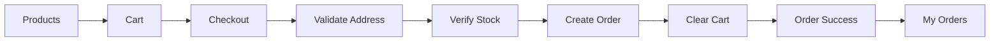
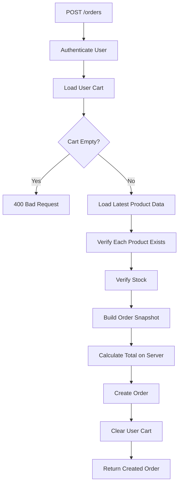

# 💳 Engineering Lab 06 — ShopKart Checkout & Orders

> **Complete the ShopKart purchase journey by converting a user's cart into a persistent order.**
>
> This is the final lab in the ShopKart sequence. Your goal is to connect everything built so far—authentication, products, wishlist, cart, state management and backend validation—into one complete full-stack flow.

---

## 📋 Lab Overview

| | |
|---|---|
| **Application** | ShopKart |
| **Lab** | 06 |
| **Duration** | 2–2.5 Hours |
| **Mode** | Individual |
| **Total Marks** | **100** |
| **Primary Theme** | Checkout + Order Creation + Business Rules |
| **Frontend** | React |
| **Backend** | Node.js + Express |
| **Database** | MongoDB |
| **Authentication** | JWT |
| **State Management** | Reuse existing Cart state |

---

# 1. 🎯 Product Brief

A customer has added products to their cart.

But a cart is still temporary.

The application must now answer:

- Where should the order be delivered?
- Are all cart items still available?
- What price should be saved in the order?
- What happens after the order is placed?
- Should the cart remain populated?
- Can the user view previous orders?

### Desired experience

```text
Cart
  ↓
Proceed to Checkout
  ↓
Enter Shipping Details
  ↓
Review Order
  ↓
Place Order
  ↓
Order Created
  ↓
Cart Cleared
  ↓
Order Confirmation
  ↓
My Orders
```

---

# 2. 🧑‍💻 What Are You Building?

You are extending the ShopKart application from Labs 01–05.

### Final user journey



### Feature scope

- Shipping address form
- Checkout page
- Final cart review
- Final stock verification
- Order schema
- Create Order API
- Order price snapshot
- Clear cart after successful order
- Order confirmation page
- My Orders page
- Protected order APIs
- Loading, validation and error states

> No real payment gateway is required in this lab.

---

# 3. 🧠 Learning Objectives

By the end of this lab, you should understand:

### Backend

- Converting temporary state into permanent business data
- Order modelling
- Snapshotting product information
- Server-side stock validation
- Protected user-specific resources
- Updating multiple related resources in one workflow

### Frontend

- Multi-step user flow
- Form state and validation
- Checkout UX
- Server mutation followed by global-state reset
- Rendering historical data

### Engineering

- Why the server must revalidate important business rules
- Why order data should not depend entirely on future Product changes
- Why successful mutations must update all affected parts of the UI

---

# 4. 📦 Order Data Model

Create a new `Order` model.

Recommended structure:

```js
const orderSchema = new mongoose.Schema(
  {
    user: {
      type: mongoose.Schema.Types.ObjectId,
      ref: "User",
      required: true
    },

    items: [
      {
        product: {
          type: mongoose.Schema.Types.ObjectId,
          ref: "Product",
          required: true
        },
        name: {
          type: String,
          required: true
        },
        price: {
          type: Number,
          required: true
        },
        quantity: {
          type: Number,
          required: true
        },
        image: {
          type: String
        }
      }
    ],

    shippingAddress: {
      fullName: String,
      phone: String,
      addressLine1: String,
      city: String,
      state: String,
      pincode: String
    },

    totalAmount: {
      type: Number,
      required: true
    },

    status: {
      type: String,
      default: "PLACED"
    }
  },
  { timestamps: true }
);
```

### Why snapshot name and price?

Suppose:

```text
Today:
Keyboard = ₹2,999

Next month:
Keyboard = ₹3,499
```

An old order should still show:

```text
₹2,999
```

The order represents what the user actually purchased at that time.

---

# 5. 🔌 API Contract

| Method | Endpoint | Auth | Purpose |
|---|---|:---:|---|
| POST | `/orders` | ✅ | Create order from current cart |
| GET | `/orders` | ✅ | Get current user's orders |
| GET | `/orders/:id` | ✅ | Get one order |

---

# 6. 🧩 Task 1 — Create Order Model
### **15 Marks**

Create the Order schema.

### Requirements

- User reference
- Array of order items
- Product reference in each item
- Product name snapshot
- Product price snapshot
- Quantity
- Optional image snapshot
- Shipping address
- Total amount
- Status
- Created timestamp

Do not store only:

```js
{
  productId,
  quantity
}
```

An order must remain meaningful even if Product data changes later.

---

# 7. 🏠 Task 2 — Checkout Page
### **15 Marks**

Create:

```text
/checkout
```

The user should reach this page using:

```text
Proceed to Checkout
```

from the Cart page.

### Checkout layout

```text
┌────────────────────────────────────────────────────────────┐
│ Checkout                                                   │
├────────────────────────────────────────────────────────────┤
│ Shipping Details                                           │
│                                                            │
│ Full Name      [________________________]                   │
│ Phone          [________________________]                   │
│ Address        [________________________]                   │
│ City           [________________________]                   │
│ State          [________________________]                   │
│ Pincode        [________________________]                   │
│                                                            │
├────────────────────────────────────────────────────────────┤
│ Order Summary                                              │
│                                                            │
│ Keyboard × 2                           ₹5,998               │
│ Mouse × 1                              ₹1,499               │
│                                                            │
│ Total                                  ₹7,497               │
│                                                            │
│                      [ Place Order ]                        │
└────────────────────────────────────────────────────────────┘
```

---

# 8. ✍️ Task 3 — Shipping Form Validation
### **10 Marks**

The checkout form should collect:

- Full Name
- Phone Number
- Address Line
- City
- State
- Pincode

### Validation rules

- No required field can be empty
- Phone should contain a valid number format
- Pincode should contain 6 digits
- Whitespace-only input is invalid

Display field-level or form-level validation errors.

Example:

```text
Pincode must contain 6 digits.
```

Do not call the backend if basic client validation fails.

---

# 9. 🛡️ Task 4 — Create Order API
### **20 Marks**

### Endpoint

```http
POST /orders
```

### Request body

The frontend should send only the shipping address.

Example:

```json
{
  "shippingAddress": {
    "fullName": "Aarav Sharma",
    "phone": "9876543210",
    "addressLine1": "22 MG Road",
    "city": "Bengaluru",
    "state": "Karnataka",
    "pincode": "560001"
  }
}
```

> Do not trust cart prices or totalAmount sent by the frontend.

### Required backend flow



---

# 10. 📦 Final Stock Verification

Before creating the order, validate every cart item again.

Example:

```text
Cart:
Keyboard × 3

Current Product Stock:
Keyboard = 2
```

The order must fail.

Return:

```http
400 Bad Request
```

with a useful message such as:

```text
Insufficient stock for Mechanical Keyboard.
```

Why?

Because stock may have changed after the item was added to the cart.

---

# 11. 🧮 Server-Side Total Calculation

The backend must calculate:

```text
totalAmount = Σ(latestProduct.price × quantity)
```

Example:

```text
Keyboard
₹2,999 × 2 = ₹5,998

Mouse
₹1,499 × 1 = ₹1,499

Total = ₹7,497
```

### Important

Never trust this from the frontend:

```json
{
  "totalAmount": 1
}
```

The server owns pricing rules.

---

# 12. 🧾 Order Snapshot Creation

When the order is created, copy the current Product information into each order item.

Example:

```js
{
  product: product._id,
  name: product.name,
  price: product.price,
  quantity: cartItem.quantity,
  image: product.image
}
```

This is intentionally different from the Cart model.

### Cart

Dynamic reference to current product data.

### Order

Historical snapshot of purchase-time data.

---

# 13. 🧹 Task 5 — Clear Cart After Success
### **5 Marks**

After the Order is successfully saved:

```js
user.cart = [];
```

Save the user.

The frontend must also update its global Cart state.

Expected flow:

```text
Place Order
    ↓
POST /orders
    ↓
Order created
    ↓
Backend cart cleared
    ↓
Frontend cart state cleared
    ↓
Navbar becomes Cart (0)
```

Do not clear the cart before the order has been successfully created.

---

# 14. ✅ Task 6 — Order Confirmation
### **10 Marks**

After successful order creation, navigate to an order success screen.

You may use:

```text
/order-success/:id
```

or:

```text
/orders/:id
```

Suggested UI:

```text
✅ Order Placed Successfully

Order ID:
67abc123...

Total:
₹7,497

Status:
PLACED

Your order has been saved successfully.

[ View My Orders ]
[ Continue Shopping ]
```

---

# 15. 📚 Task 7 — My Orders API
### **10 Marks**

### Endpoint

```http
GET /orders
```

Return only orders belonging to the authenticated user.

Recommended sorting:

```text
Newest order first
```

Example response:

```json
{
  "success": true,
  "orders": [
    {
      "_id": "67abc123",
      "totalAmount": 7497,
      "status": "PLACED",
      "createdAt": "2026-10-05T10:00:00.000Z",
      "items": []
    }
  ]
}
```

---

# 16. 🧾 Task 8 — My Orders Page
### **10 Marks**

Create:

```text
/orders
```

Suggested UI:

```text
My Orders

┌────────────────────────────────────────────────────┐
│ Order #67abc123                                    │
│ 5 Oct 2026                                         │
│                                                    │
│ Keyboard × 2                                       │
│ Mouse × 1                                          │
│                                                    │
│ Total: ₹7,497                                      │
│ Status: PLACED                                     │
│                                                    │
│ [ View Details ]                                   │
└────────────────────────────────────────────────────┘
```

The page must support:

- Loading state
- Empty state
- Error state

### Empty state

```text
You have not placed any orders yet.

[ Start Shopping ]
```

---

# 17. 🔍 Single Order API

### Endpoint

```http
GET /orders/:id
```

### Rules

- User must be authenticated
- Order must exist
- User must own the order

A user must never be able to access another user's order by guessing its ID.

---

# 18. 🚨 Important Business Rules

| Rule | Expected Behaviour |
|---|---|
| User must be authenticated | Protect all order APIs |
| Cart cannot be empty | Reject order |
| Product deleted after cart addition | Reject order |
| Stock becomes insufficient | Reject order |
| Frontend sends fake total | Ignore it |
| Order created successfully | Clear cart |
| Order creation fails | Keep cart unchanged |
| Product price changes later | Old order price stays unchanged |
| User requests someone else's order | 404 or 403 |
| Invalid shipping data | Reject request |

---

# 19. 🧪 Postman Test Plan

Test the backend before wiring React.

### Test 1 — Empty cart

```http
POST /orders
```

Expected:

```text
400 Bad Request
```

### Test 2 — Valid order

Expected:

```text
201 Created
```

### Test 3 — Confirm cart cleared

```http
GET /cart
```

Expected empty cart.

### Test 4 — Get Orders

```http
GET /orders
```

Expected newly created order.

### Test 5 — Insufficient stock

Add quantity greater than available stock and try checkout.

Expected:

```text
400 Bad Request
```

### Test 6 — Fake total sent from frontend

Send:

```json
{
  "totalAmount": 1
}
```

Backend should ignore it and calculate the real total.

### Test 7 — Unauthenticated request

Expected:

```text
401 Unauthorized
```

### Test 8 — Access another user's order

Expected:

```text
403 Forbidden
```

or:

```text
404 Not Found
```

---

# 20. 🧱 Suggested Backend Structure

```text
backend/
│
├── controllers/
│   ├── cart.controller.js
│   └── order.controller.js
│
├── models/
│   ├── user.model.js
│   ├── product.model.js
│   └── order.model.js
│
├── routes/
│   ├── cart.routes.js
│   └── order.routes.js
│
├── middlewares/
│   └── auth.middleware.js
│
└── index.js
```

---

# 21. 🧱 Suggested Frontend Structure

```text
src/
│
├── pages/
│   ├── Cart.jsx
│   ├── Checkout.jsx
│   ├── Orders.jsx
│   └── OrderDetails.jsx
│
├── components/
│   ├── CheckoutForm.jsx
│   ├── OrderSummary.jsx
│   └── OrderCard.jsx
│
├── features/
│   └── cart/
│       └── cartSlice.js
│
├── services/
│   └── api.js
│
└── App.jsx
```

You may structure the application differently if responsibilities remain clear.

---

# 22. ✅ Acceptance Criteria

## Backend

- [ ] Order model exists
- [ ] Order stores purchase-time snapshot
- [ ] Shipping address is validated
- [ ] Order API uses authenticated user's cart
- [ ] Product data is loaded again before order creation
- [ ] Stock is verified again
- [ ] Total is calculated on server
- [ ] Fake frontend totals are ignored
- [ ] Order is persisted
- [ ] Cart clears only after successful order creation
- [ ] Get Orders API returns current user's orders
- [ ] Single order API enforces ownership

## Frontend

- [ ] Checkout page exists
- [ ] Shipping form works
- [ ] Form validation exists
- [ ] Final cart summary is shown
- [ ] Place Order has loading state
- [ ] Backend errors are visible
- [ ] Successful order clears global cart state
- [ ] Navbar updates to Cart (0)
- [ ] Confirmation screen exists
- [ ] My Orders page exists
- [ ] Loading state exists
- [ ] Empty state exists
- [ ] Error state exists

---

# 23. 📊 Evaluation Rubric

| Area | Marks |
|---|---:|
| Order Model + Snapshot Design | 15 |
| Checkout Page + Shipping Form | 15 |
| Form Validation | 10 |
| Create Order API | 20 |
| Stock + Server Total Validation | 10 |
| Cart Clearing + State Sync | 5 |
| Order Confirmation | 10 |
| My Orders API + Page | 10 |
| Code Quality + Error Handling | 3 |
| Viva | 2 |
| **Total** | **100** |

---

# 24. 🎤 TA Viva Questions

Ask any 5–7 depending on implementation.

### Orders

1. Why does an Order store product name and price separately from the Product document?
2. Why should order price not change when product price changes?
3. What is the difference between Cart data and Order data?
4. Why should an Order reference the User?

### Security & Business Logic

5. Why should the backend calculate totalAmount?
6. Why must stock be checked again during checkout?
7. Why should the frontend not send the final order items as trusted data?
8. How do you prevent a user from reading someone else's order?

### State Management

9. Why must global cart state be cleared after order creation?
10. What happens if the backend order succeeds but frontend state is not updated?
11. Why should cart remain untouched if order creation fails?

### React

12. Where should checkout form state live?
13. What loading states should exist while placing an order?
14. What should happen if the cart is empty and a user directly opens `/checkout`?

---

# 25. 🚫 Common Mistakes

### ❌ Trusting total from frontend

Never do:

```js
const totalAmount = req.body.totalAmount;
```

Calculate it on the server.

---

### ❌ Storing only Product references in orders

If product data changes, order history becomes inaccurate.

Snapshot important purchase-time information.

---

### ❌ Clearing cart before order save

Wrong:

```text
Clear Cart
   ↓
Create Order
   ↓
Order fails
```

The customer loses their cart.

Correct:

```text
Create Order
   ↓
Success
   ↓
Clear Cart
```

---

### ❌ Skipping final stock check

Cart state may be old.

Stock can change between:

```text
Add to Cart → Checkout
```

---

### ❌ Allowing any authenticated user to fetch any order

Always verify:

```text
order.user === req.user.id
```

---

# 26. 🌟 Bonus Challenge (+10 Marks)

Implement basic order status progression.

Allowed values:

```text
PLACED
CONFIRMED
SHIPPED
DELIVERED
```

For the bonus, you may create a temporary development/admin endpoint to update status.

Then display status visually on the Orders page.

---

# 27. 🏁 Final ShopKart Journey

After completing Lab-06, your application should support:

```text
Register / Login
       ↓
Browse Products
       ↓
Search / Filter
       ↓
Wishlist
       ↓
Shopping Cart
       ↓
Global Cart State
       ↓
Checkout
       ↓
Shipping Details
       ↓
Server Validation
       ↓
Order Creation
       ↓
Order History
```

You have now built the major flow of a real full-stack commerce application.

The important part is not the shopping website itself.

The important part is that you have implemented:

- Authentication
- Protected APIs
- MongoDB relationships
- REST APIs
- React routing
- Global state
- Derived state
- Form handling
- Business-rule validation
- Data persistence
- Historical snapshots
- End-to-end frontend/backend integration

---

<div align="center">

## 🚀 Final Lab — Ship the complete flow.

**Happy Building — ShopKart Team**

</div>
